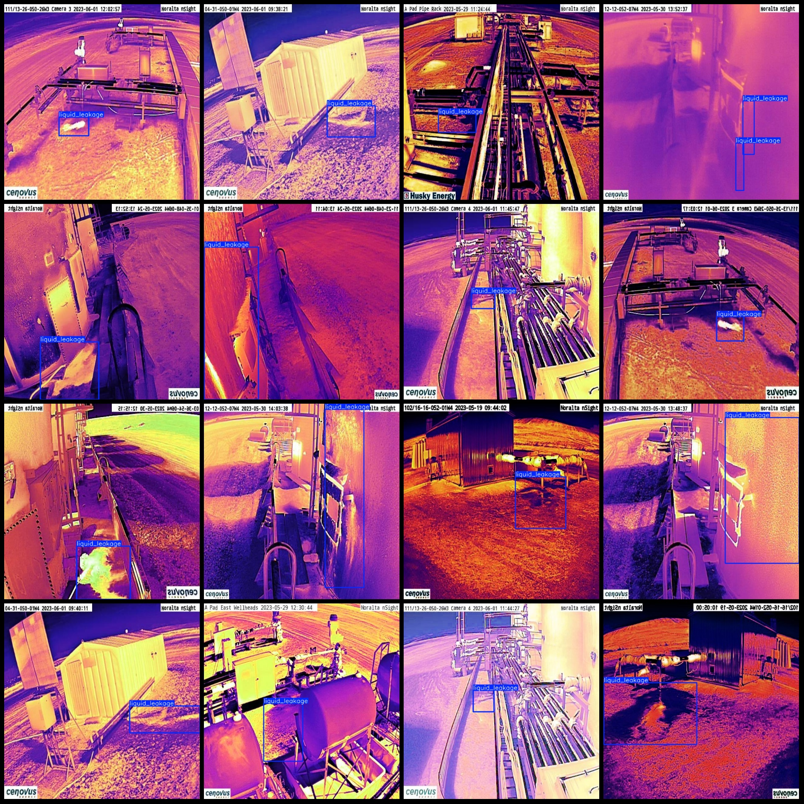
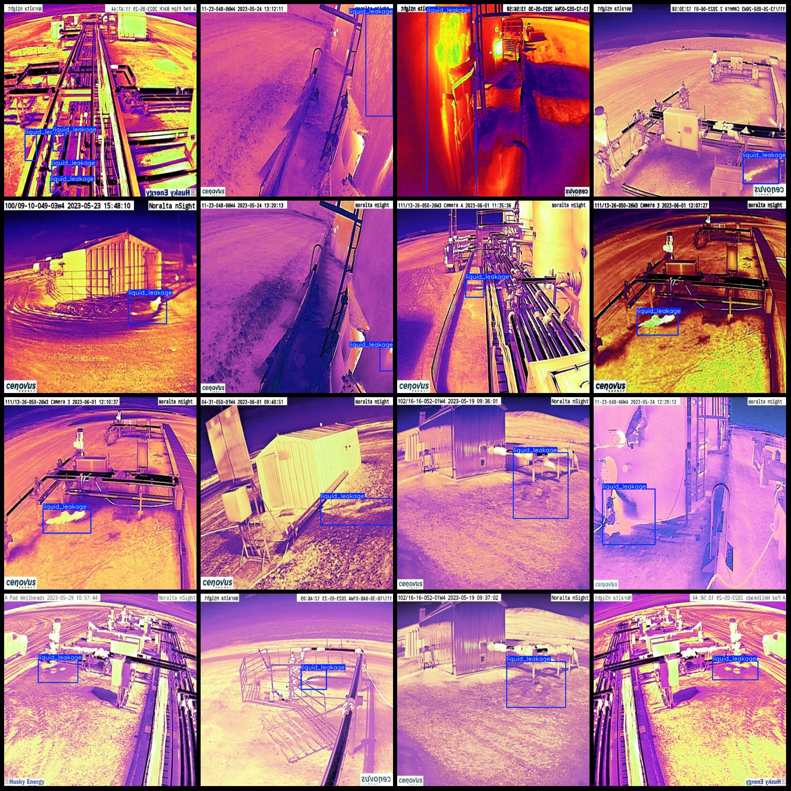

# Intelligent Factory Infrared Image Fluid Leakage Detection Dataset VOC+YOLO Format: 2072 Images, 1 Category

Dataset format: Pascal VOC format + YOLO format (txt file without split path, only containing jpg images and corresponding VOC format xml files and yolo format txt files)
Number of images (jpg file count): 2072
Number of annotations (xml file count): 2072
Number of annotations (txt file count): 2072
Number of annotation categories: 1
Annotation category name: "liquid_leakage"
Number of bounding box per category: 4329
Total bounding box count: 4329
Image resolution: 640x640
Annotation tool used: labelImg
Annotation rules: Draw a rectangle around the category
Important notes: None
Special declaration: This dataset does not guarantee the accuracy of the trained model or weight files.
Preview of images:
Annotation example:

## Images

Here is a pay link on Stripe ( https://buy.stripe.com/3cs8yP7sY87d0vu9AB ). Please contact me lonlonago@foxmail.com after funding $89, and I will send you a complete data files , thank you!

